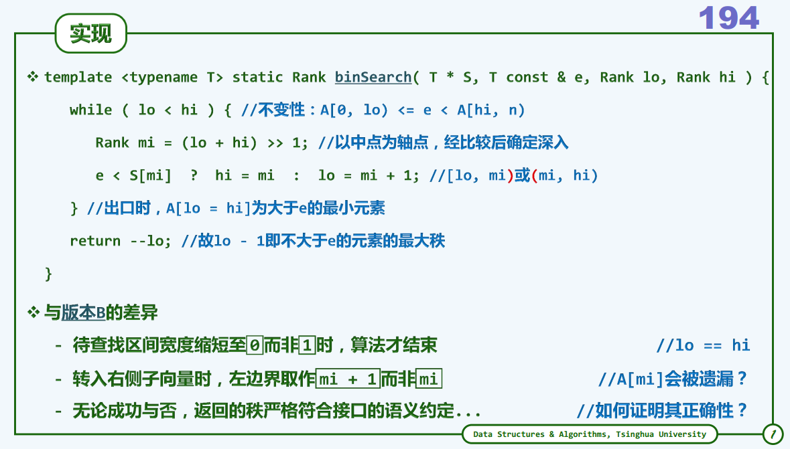

### 1. 所使用数据结构与算法的构思、原理和实现要点。

​       完成过程中用到了range tree、栈、向量。其中，主要的数据结构是range tree. 但是与正式的range tree不同，这里我在第二个维度存储的是向量，而且是排序好的，因此二维查找也可以比较快。

​       原理很简单，就是先查x，再查y。那么要先对x构造一棵range tree。但是无法避免地会遇到原坐标中有很多重复的x值。因此我需要先对x值进行一次快速排序（是整个结构体一块排），然后扫描，把不重复的x值因此存入一个向量，而且把这些不同的x值（一段一段的）的起始坐标和结束坐标也存下来，这对于之后查y值有用。

​       然后就开始构造x的range tree。思路就是一直分小区间。比如原来的大区间为[left, right]。划分一次后为[left, mid]和[mid+1, right]，其中mid = (left + right) >> 1. 此处把中位数划到了左侧，需要在之后查询时注意。方便起见，在range tree里面存的并不是left，right这样的坐标，而是直接存它们对应的x值，并且把中位数也存下来。对于这个区间（实际上是range tree里面的一个节点），我把区间所对应的y值存进去它的vector里面。那么，y值所对应的rank的范围也就是左边界的起始rank到右边界的结束rank（这里说明了为何要存下来每段x值的起始坐标和结束坐标）。但是由于我们需要的并不是某个范围内的（x，y）坐标，而是温度，因此我在这里存的是rank。存好了以后把这个向量对于y值做一次快速排序，方便以后的查找。

​       如此划分下去，很显然，最小的区间长度就是1，也就是只有一个x值（这里就体现了一开始对x值进行排序的重要性）。这应该也是查询的终点，需要注明其为叶节点(isExternal = true)。

​       查询时，先查找x。对于查询目标[x1, x2]：

​              如果左边界left大于x2或者右边界right小于x1，说明没有交集，结束查询。

​              如果到达叶节点，再看叶节点是否在区间内，若是再查询y值，结束查询。

​              如果没有达到叶节点：如果当前区间被包含于查询区间，再查询y值，结束查询。如果没有包含于：看当前节点的中位数x_mid。如果x_mid<=x1，那么说明左子区间和右子区间都与查询区间有交集，需要深入左孩子和右孩子查询。而如果x_mid >= x2，只需要查询左孩子。如果x_mid < x1，只需要查询右孩子。注意：这里取等的不对称性正是由于划分区间的时候将中位数归入左孩子所致。

​              对于查询y值，进行二分查找即可。

### 2. 完成过程中遇到的问题，排除问题的主要过程、使用的方法和技巧，以及参考资料。

​       我遇到的最大的问题估计是传参吧。一开始在我的主函数里面直接定义long long的温度总和sum_t和int的个数count。然后传到query函数查询，总是查不出来…而我在本地用vs即使是查50000个点也很轻松。后来我放弃了在主函数里定义参数，用Query函数再包装一层，而且把原来的递归版本加了个辅助栈。值得一提的是把range tree的建立和query都用辅助栈加以实现，耗时将减少很多。

​       再者就是，由于我需要对大量数据查询，需要传递比如y向量这样可能规模比较大的参数。一开始我在函数里面直接定义相关参数，但是90%测试中有好几个超时，后来我就改成引用了，最后才差不多通过测试。

### 3. 时间和空间复杂度的估算。

​       时间复杂度：做一次快排O(nlongn)，扫描重复的x值为O(n)，建立range tree时，划分x为O(logn)（考虑一般的情况，即不重复的x值大概跟n一个量级），而插入y为O(n)。对y快排，某一层有$2^n$个 节点，y向量长度加起来为n，那么一个节点的长度期望值为$\frac { 2 ^ { n } } { n }$，于是快排总耗时$2 ^ { n } O \left( \frac { n } { 2 ^ { n } } \log \left( \frac { n } { 2 ^ { n } } \right) \right)$ ，因此时间可以忽略不计。因此建立树需要O(nlogn)的时间。查询时每个维度的查询均为O(logn)，而且还有对于k个位于区间内的点计算温度总和的时间，因此查询的时间复杂度为$O \left( k + \log ^ { 2 } ( n ) \right)$.

​       空间复杂度：存储数组、不重复X、起始坐标、介绍坐标都为O(n)，区间树为O(nlog

)，总体为O(nlog(n))。

 

### 4. （可选）介绍理论分析与实测效果的吻合程度，不吻合时进一步解释原因。

### 5. （可选）所用方法的特别、新颖或创新之处。

查询y值时，我比较得意的是，查询的时候利用到了课堂上讲过的二分查找的C版本。对于一个查询区间[y1, y2]，我应该给出的结果是大于等于y1的最小值到小于等于y2的最大值。如下页ppt所示，S[lo - 1]总是当前不大于e的最大值，S[hi]是大于e的最小值。这样解决了y2.

这段代码再稍微改一下，也即，把e<S[mi]改成e<=S[mi]，那么S[lo - 1]总是当前小于e的最大值，S[hi]是大于等于e的最小值。这样解决了y1.

 